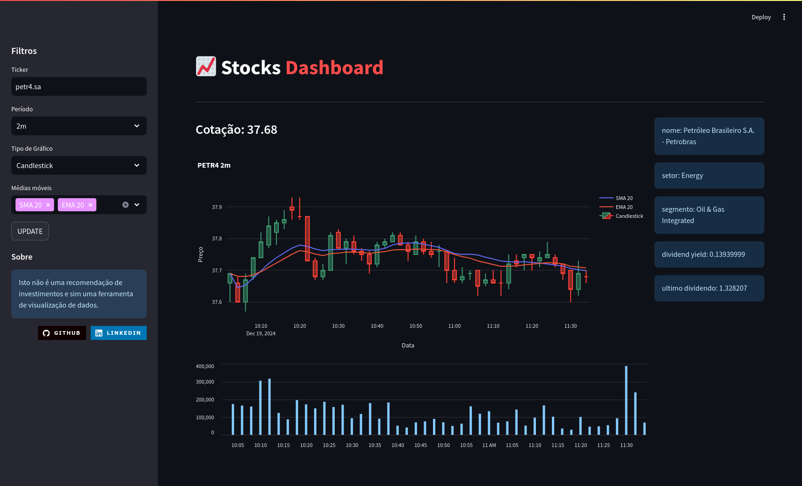

# Stocks Dashboard



## **Descrição**

Este projeto implementa uma dashboard interativa para visualização de gráficos de preços de ações utilizando **Streamlit**, **Plotly** e **Yahoo Finance**. Ele permite que os usuários consultem informações financeiras e visualizem gráficos de preços históricos de ações em tempo real, com a possibilidade de adicionar indicadores como **Médias Móveis Simples (SMA)** e **Médias Móveis Exponenciais (EMA)**.

## **Arquitetura do Projeto**

O projeto é composto pelos seguintes arquivos principais:

- **app.py**: O arquivo principal onde a interface da dashboard é criada utilizando o Streamlit. Este arquivo lida com a interação do usuário, coleta de dados e visualização dos gráficos.
- **data_utils.py**: Contém a classe `DataUtils`, que é responsável por coletar os dados das cotações de ações usando a API do **Yahoo Finance**.
- **indicadores.py**: Define a função `add_indicadores`, que adiciona indicadores financeiros (como SMA e EMA) ao DataFrame de dados.
- **Dockerfile**: Arquivo de configuração para criar uma imagem Docker que facilita a implementação do projeto em qualquer ambiente.

---

## **Requisitos**

### **Bibliotecas Necessárias**

As dependências do projeto são gerenciadas pelo arquivo `requirements.txt`. As bibliotecas principais incluem:

- **streamlit**: Para criar a interface interativa da dashboard.
- **plotly**: Para criar gráficos dinâmicos e interativos.
- **yfinance**: Para acessar dados financeiros de ações.
- **loguru**: Para gerenciar logs de execução.

Para instalar as dependências, execute:

```bash
pip install -r requirements.txt
```

---

## **Configuração e Execução**

### **1. Rodando o projeto localmente**

Para executar o projeto em sua máquina local, siga os passos abaixo:

1. **Clone o repositório**:
   ```bash
   git clone https://github.com/esscova/stock_screen.git
   cd stock_screen
   ```

2. **Instale as dependências**:
   ```bash
   pip install -r requirements.txt
   ```

3. **Execute o Streamlit**:
   No diretório do projeto, execute:
   ```bash
   streamlit run app.py
   ```

4. **Acesse a dashboard**:
   Após o comando acima, o Streamlit abrirá automaticamente a dashboard no seu navegador. Caso contrário, você pode acessá-la manualmente em `http://localhost:8501`.

### **2. Utilizando o Docker**

Se preferir rodar o projeto em um container Docker, você pode usar o seguinte comando:

1. **Crie a imagem Docker**:
   ```bash
   docker build -t stock_screen .
   ```

2. **Execute o container Docker**:
   ```bash
   docker run -p 8501:8501 stock_screen
   ```

3. **Acesse a dashboard**:
   Abra o navegador e vá para `http://localhost:8501`.

---

## **Como Usar a Dashboard**

### **1. Filtros**

Na barra lateral esquerda, você encontrará as opções para personalizar sua visualização de dados:

- **Ticker**: Insira o código da ação que deseja visualizar (ex: `AAPL` para Apple, `MSFT` para Microsoft).
    - Para Empresas do Brasil é necessário terminar o ticker com `.SA`. Exemplo: `PETR4.SA`.
- **Período**: Selecione o intervalo de tempo para o gráfico. As opções incluem:
  - `1m`, `2m`, `5m`, `15m`, `30m`, `60m`: Intervalos de minutos.
  - `1d`, `5d`, `1wk`, `1mo`, `3mo`: Intervalos de dias, semanas e meses.
- **Tipo de Gráfico**: Escolha entre "Line" (gráfico de linha) ou "Candlestick" (gráfico de velas).
- **Médias Móveis**: Selecione os indicadores de médias móveis que deseja adicionar ao gráfico:
  - **SMA 20** (Média Móvel Simples de 20 períodos)
  - **EMA 20** (Média Móvel Exponencial de 20 períodos)
- **UPDATE**: Clique no botão "UPDATE" para aplicar os filtros e atualizar a visualização.

### **2. Visualização de Dados**

Na área principal, você verá duas seções principais:

- **Gráfico de Preços**: Exibe um gráfico interativo do preço da ação selecionada, com a possibilidade de visualizar os indicadores técnicos selecionados.
  - **Gráfico de Linha**: Exibe a variação do preço de fechamento ao longo do tempo.
  - **Gráfico de Candlestick**: Exibe os preços de abertura, fechamento, máxima e mínima para cada período.
  
- **Informações da Ação**: Exibe informações adicionais sobre a ação, como:
  - Nome da empresa
  - Setor e segmento
  - Dividend Yield
  - Último dividendo pago

Se ocorrer algum erro, uma mensagem de erro será exibida, indicando que os dados não puderam ser carregados.

---

## **Estrutura de Arquivos**

### **app.py**

Este arquivo é o principal ponto de entrada para o Streamlit. Ele configura a interface, os filtros e a lógica de exibição do gráfico. Abaixo está um resumo das principais seções:

- **Configuração da interface**: O Streamlit é configurado com a opção de layout "wide" e o título da página é configurado como `Stocks Dashboard`.
- **Menu lateral**: Aqui, os filtros são configurados para coletar os inputs do usuário, como o ticker da ação, o intervalo de tempo e os tipos de gráficos.
- **Exibição de gráficos**: Dependendo dos filtros aplicados, a função de visualização usa o Plotly para criar o gráfico de linha ou candlestick, incluindo indicadores técnicos se selecionados.
  
### **data_utils.py**

Contém a classe `DataUtils`, que é responsável por interagir com a API **Yahoo Finance** para buscar os dados históricos de cotações. A função `fetch_cotacoes` obtém os preços das ações com base no ticker e no intervalo, enquanto `fetch_data` traz informações adicionais sobre a ação.

### **indicadores.py**

Define a função `add_indicadores`, que calcula e adiciona as médias móveis (SMA e EMA) ao DataFrame de preços da ação.

### **Dockerfile**

Configura o ambiente Docker para garantir que o projeto possa ser executado em qualquer máquina com Docker instalado. Ele instala as dependências, copia os arquivos e define o comando para rodar o Streamlit.

---

## **Logs**

O projeto utiliza a biblioteca **loguru** para registrar logs de execução. Estes logs são salvos em arquivos de log, localizados na pasta `logs/`:
- **main.log**: Logs principais da execução da dashboard.
- **data_utils.log**: Logs relacionados à coleta de dados financeiros.
- **indicadores.log**: Logs relacionados à adição de indicadores técnicos.

---

## **Contribuições**

Sinta-se à vontade para contribuir com melhorias ou relatar bugs. As contribuições podem ser feitas através de **pull requests** no GitHub.

- **GitHub**: [https://github.com/esscova](https://github.com/esscova)
- **LinkedIn**: [Wellington Moreira Santos](https://www.linkedin.com/in/wellington-moreira-santos/)

---

**Licença**: Este projeto está licenciado sob a Licença MIT - consulte o arquivo [LICENSE](LICENSE) para mais detalhes.
